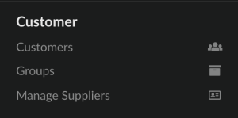
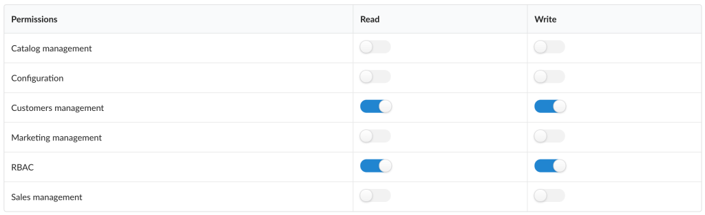
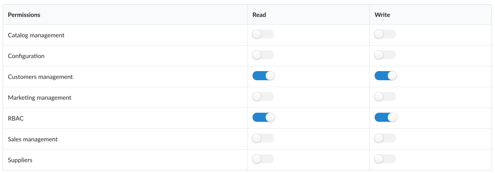

<p align="center">
    <a href="https://sylius.com" target="_blank">
        
    </a>
</p>

<h1 align="center">Rbac Plugin</h1>

<p align="center"><a href="https://sylius.com/plugins/" target="_blank"></a></p>

<p align="center">This plugin provides basic roles and permissions management functionality for Sylius application.</p>

#### Beware!

Adding Write access to a permission automatically means adding Read access.

Write permission access means also updating and deleting.

## Installation

1. Require plugin with composer:

    ```bash
    composer require sylius/rbac-plugin
    ```

2. Add plugin class and other required bundles to your `AppKernel`.

    ```php
    $bundles = [
       new \Sylius\RbacPlugin\SyliusRbacPlugin(),
    ];
    ```

3. Make sure to have ProophServiceBusBundle in your `AppKernel` as well:

    ```php
    $bundles = [
        new \Prooph\Bundle\ServiceBus\ProophServiceBusBundle(),
    ];
    ```

4. Override AdminUser entity:

a) Use AdministrationRoleTrait and implement AdministrationRoleAwareInterface in the AdminUser class of your Sylius-Standard based project:

```php
/**
 * @MappedSuperclass
 * @Table(name="sylius_admin_user")
 */
class AdminUser extends BaseAdminUser implements AdminUserInterface, AdministrationRoleAwareInterface
{
    use AdministrationRoleTrait;
}
```

b) And override the model's class in the chosen configuration file (e.g. `config/_sylius.yaml`):

```yaml
sylius_user:
    resources:
        admin:
            user:
                classes:
                    model: App\Entity\AdminUser
```

5. Import routing:

    ```yaml
    sylius_rbac:
        resource: "@SyliusRbacPlugin/Resources/config/routing.yml"
    ```

6. Import configuration:

    ```yaml
    - { resource: "@SyliusRbacPlugin/Resources/config/config.yml" }
    ```

7. Copy plugin migrations to your migrations directory (e.g. `src/Migrations`) and apply them to your database:

    ```bash
    cp -R vendor/sylius/rbac-plugin/migrations/* "<path/to/your/migrations>"
    bin/console doctrine:migrations:migrate
    ```

8. Copy templates from `vendor/sylius/rbac-plugin/src/Resources/views/SyliusAdminBundle/`
to `app/Resources/SyliusAdminBundle/views/`

9. Run installation command

    ```bash
    bin/console sylius-rbac:install-plugin
    ```

    Which consists of:
    
    * `sylius:fixtures:load`
    
        Loading fixture with a default "No sections access" role. 
        
        The command runs in non-interactive mode so it will NOT purge your database. 
        However, once you run it again it will throw an exception because of duplicate entry constraint violation.
        
        If you want to install RBAC plugin again on the same environment you will have to remove all roles manually 
        via administration panel or run all commands except `sylius:fixtures:load` separately.
        
    * `sylius-rbac:normalize-administrators`
    
        Assigns role created in a previous step to all already existent administrators.

    * `sylius-rbac:grant-access <roleName> <adminSections>`

        Where `adminSections` can be a space-separated list of any of these:
        * catalogManagement
        * configuration
        * customerManagement
        * marketingManagement
        * salesManagement
        
        #### Beware!
        
        There are two ways of defining root administrator's email address:
        
        * Provide it as a parameter in your configuration file (you will not be asked to enter it again via CLI during
        plugin's installation)
        
        ```yaml
        parameters:
            root_administrator_email: example@example.com
        ``` 
        
        * Provide it via CLI
    
        e.g. `bin/console sylius-rbac:grant-access administrator configuration catalogManagement`
    
        `In order to permit access to admin panel sections, please provide administrator's email address: sylius@example.com`
        
        By default, installation command creates *Configurator* role with access granted to all sections.  

#### Beware!

You can also use `bin/console sylius-rbac:grant-access-to-given-administrator <email> <roleName> <adminSections>`
command in order to provide an email address as an input parameter.

## Sections configuration

By default, **RbacPlugin** is provided with access configuration for basic Sylius sections (catalog, configuration, customers, marketing and sales) as well as for RBAC section, added by the plugin itself.
Each section has a bunch of route prefixes associated with them, that describes which section gives permissions to which resources management.

However, usually, a Sylius application has a plenty of custom functions within existing or entirely new sections. This plugin allows you to extend its configuration, in order to restrict access to these custom routes.

For the matter of example let's assume we have a simple `Supplier` resource (containing only `string $name` property). It also has already generated routes, that we would like to restrict access to:

- `app_admin_supplier_index`
- `app_admin_supplier_create`
- `app_admin_supplier_update`
- `app_admin_supplier_bulk_delete`
- `app_admin_supplier_delete`

If you don't know how to create and configure custom resource in Sylius application, check out [relevant documentation chapter](https://docs.sylius.com/en/1.3/cookbook/entities/custom-model.html).

### Extending basic Sylius section with new route prefixes

The only thing required to restrict Supplier-related routes with, for example, "Customer management" permission, is adding appropriate route prefix to customers section configuration:

```yaml
sylius_rbac:
    sylius_sections:
        customers:
            - app_admin_supplier
```

You would probably also want to add extend "Customers" section in Admin main menu (take a look at [this docs chapter](https://docs.sylius.com/en/1.3/customization/menu.html) for more information).



As a result, each Administrator allowed to manage customers in the Admin panel would also be able to manage Suppliers. You may also notice, nothing has changed in permissions configuration form,
as no new section has been added to the RBAC configuration.



### Adding a custom section to the application

What if you want to differentiate your new resources management permission? The other possibility is to define your own, custom section in a plugin configuration:

```yaml
sylius_rbac:
    custom_sections:
        suppliers:
            - app_admin_supplier
```

> Curiosity: RBAC is also defined as a custom section! You can easily check it out in a plugin source code.

With such a configuration, you should notice a new permission configuration available in the Administration Role form.



To display new permission name nicely, you should also configure a translation in your application's translation file:

```yaml
sylius_rbac:
    ui:
        permission:
            suppliers: Suppliers
```

#### Remember!

When configuring a custom section in Admin main menu, name it the same way you named it under `custom_sections` key in the plugin configuration. It will be automatically hidden and shown, exactly as
basic Sylius sections!

```php
$suppliersSubmenu = $menu->addChild('suppliers')->setLabel('Suppliers');

$suppliersSubmenu
    ->addChild('supplier', ['route' => 'app_admin_supplier_index'])
    ->setLabel('Manage Suppliers')
    ->setLabelAttribute('icon', 'address card outline')
;
```


After these few simple steps, you can already give your custom permission to any already existent Administration role.

## Security issues

If you think that you have found a security issue, please do not use the issue tracker and do not post it publicly.
Instead, all security issues must be sent to `security@sylius.com`.
